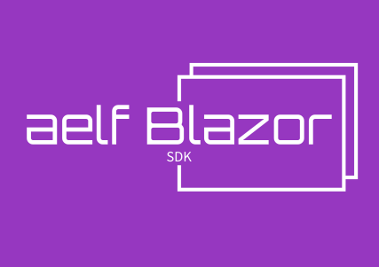
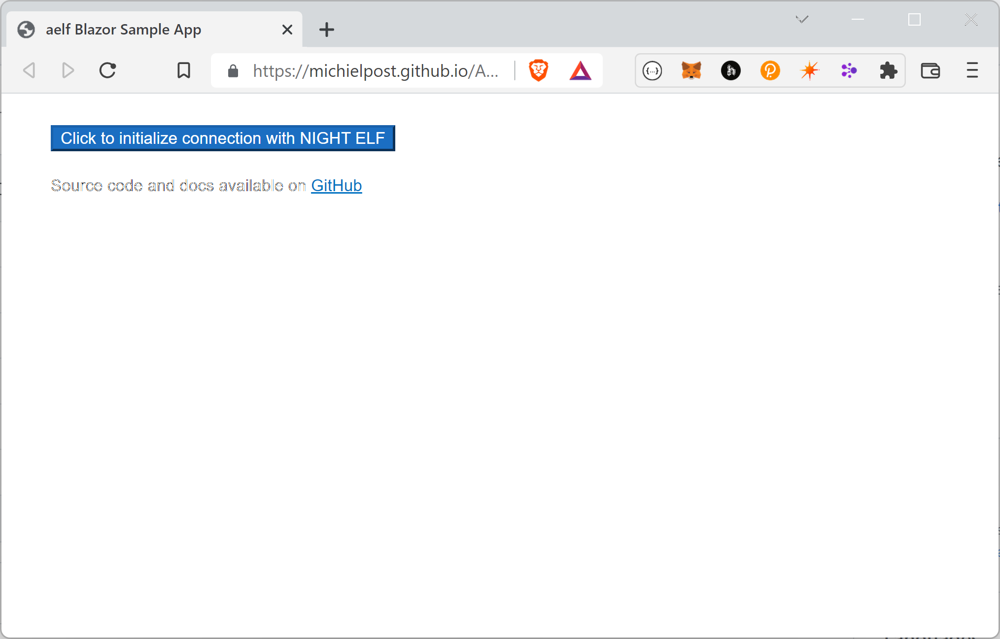
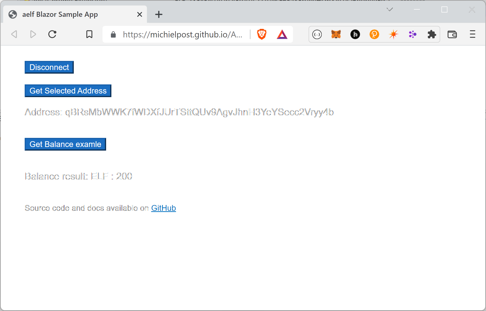
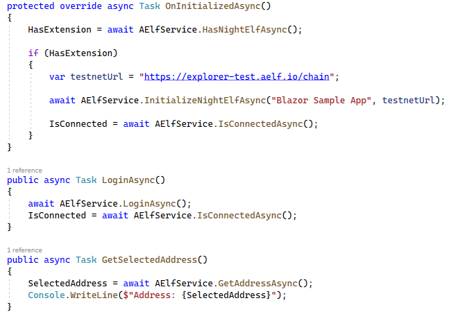

# aelf Blazor SDK


Use the [Night Elf Extension](https://chrome.google.com/webstore/detail/aelf-explorer-extension-d/mlmlhipeonlflbcclinpbmcjdnpnmkpf) with Blazor WebAssembly to communicate with the aelf Blockchain

This library provides an easy helper to use aelf with Blazor WebAssembly.

**[Live Demo](https://michielpost.github.io/AElfBlazor/)**

This project was created for the [aelf Legend X Hackathon](https://aelf.devpost.com) and allows C# developers to use Blazor to create web3 dapps for the aelf Blockchain!

## Features
- Install with a single line of C# code
- Easily connect to the Night Elf extension from your C# Blazor WebAssembly App
- Detect if the extension is installed
- Get the user's address and balance
- Call and execute smart contracts

## How to use
See included Blazor sample app.

**Install**: [AElfBlazor from NuGet](https://www.nuget.org/packages/AElfBlazor/)

Register in `Program.cs`:
```cs
builder.Services.AddAElfBlazor();
```

Inject the `AElfService` in your Razor page
```cs
@using AElfBlazor
@inject AElfService AElfService
```

or class when using a .razor.cs file:
```cs
[Inject]
public AElfService AElfService { get; set; } = default!;
```

Use the `AElfService`:

Check if the user has Night Elf installed:
```cs
bool hasExtension = await AElfService.HasNightElfAsync();
```

If the user has the extension installed, initialize the connection:
```cs
var nodeUrl = "https://explorer-test.aelf.io/chain";
bool hasExtension = await AElfService.InitializeNightElfAsync("Your App Name", nodeUrl);
```

Check if the user has connected to your site.
```cs
bool isSiteConnected = await AElfService.IsConnectedAsync();
```

Initialize a new connection with the extension
```cs
await AElfService.LoginAsync();
```

Remove the connection with the extension
```cs
await AElfService.LogoutAsync();
```

Get the address from the connected wallet
```cs
var address = await AElfService.GetSelectedAddress();
```

Get the balance from the connected wallet
```cs
var balance = await AElfService.GetBalanceAsync();
```

Read from or execute smart contracts
```cs
 var address = "address";
string functionName = "Method";
dynamic payload = new ExpandoObject();
payload.property = "value";

//Read values
var result = await AElfService.ReadSmartContractAsync<MyResultObject>(address, functionName, payload);

//Execute a method and receive a transaction id back:
var txId = await AElfService.ExecuteSmartContractAsync(address, functionName, payload);
```

## Screenshots
Initialize the connection


Interact with the extension


Easy usage from C#



## Reference
- https://github.com/AElfProject/aelf-web-extension
- https://docs.aelf.io/en/latest/resources/browser-extension.html
